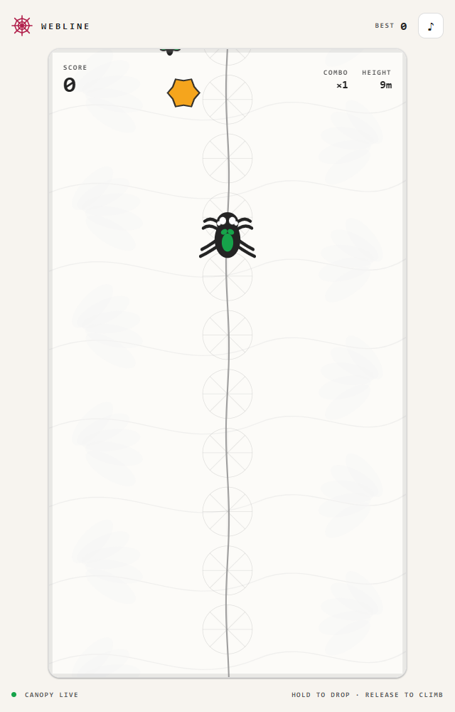
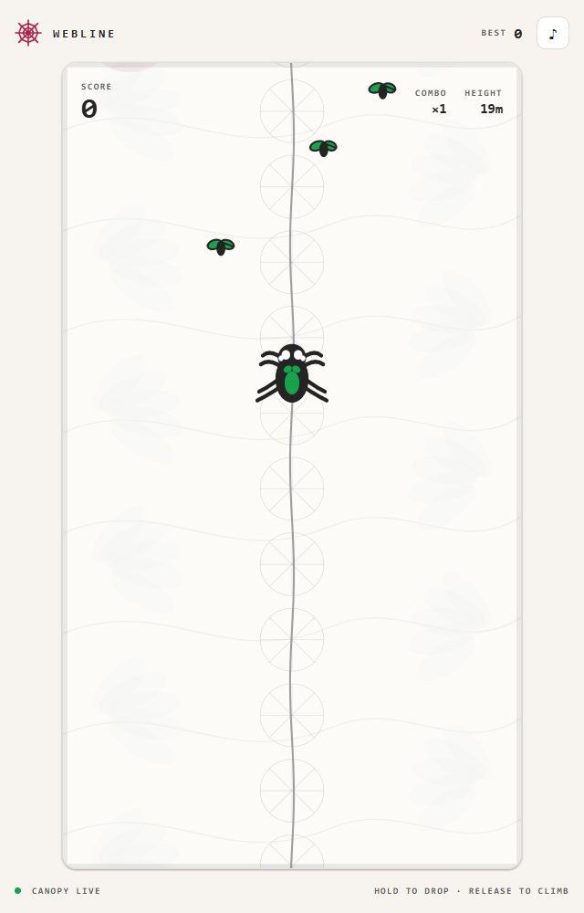
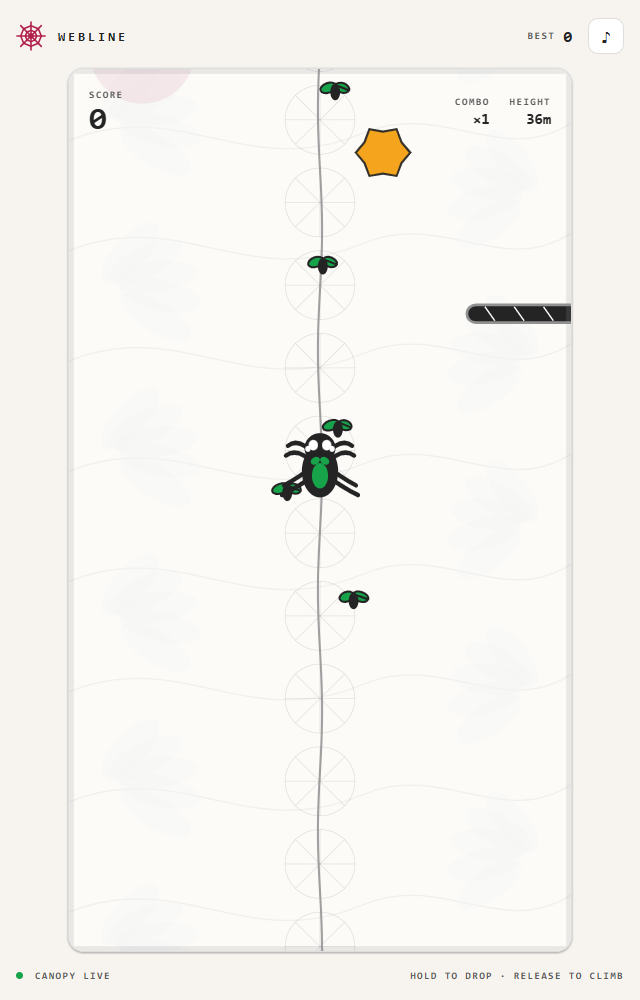

# Webline

Webline is a mobile-first, one-button browser game starring Spud, a regal
jumping spider. Release to climb an endless web and hold to drop around forest
hazards, predators, and collectible insects.

## Screenshots

| Climb the web | Chase insect trails | Dodge canopy hazards |
| :---: | :---: | :---: |
|  |  |  |

## Development

Requires Node.js 20 or newer.

```powershell
npm install
npm run dev
```

Open the local URL shown by Vite.

## Controls

- **Drop:** hold touch, mouse, Space, or Arrow Down
- **Climb:** release the control
- The game pauses when its browser tab is hidden.
- Sound preference and the best score are stored locally.

## Test and build

```powershell
npm test
npm run build
```

The production site is written to `dist\`.

## Public deployment

Webline is deployed to Azure Static Web Apps:

https://proud-meadow-0a396930f.3.azurestaticapps.net/

The deployment uses the Free tier in East US 2. To deploy updates with the
configured Azure Developer CLI environment:

```powershell
azd env select webline
azd deploy --no-prompt
```

The repeatable Bicep infrastructure is in `infra\`. Scores are local to each
browser; a shared leaderboard would require a separate backend service.
